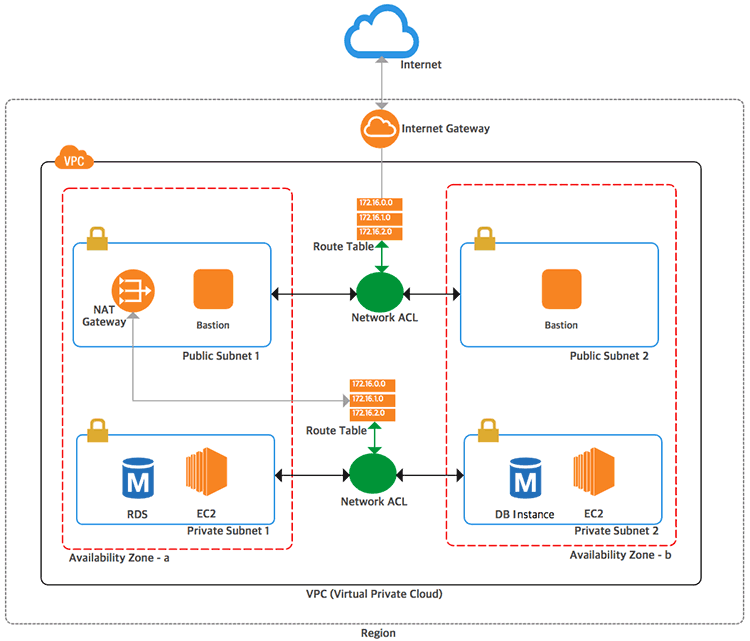

# Terraform을 통한 Resource 생성하기

## Terraform ?

terraform은 Hashicorp에서 오픈 소스로 제공하는 ICA(Infrastructure as Code)  
서비스가 되는 환경을 구성하는 프로비저닝 도구로 Cloud 환경에 제약없이 사용이 가능하다. terraform은 GUI(Graphical user interface)나 웹콘솔을 이용해 관리하던 리소스를 Code로 관리할 수 있게 한다.

### 특징

- Infrastructure ad Code : 코드 베이스
- Executaion Plans : 사전 테스트
- Resource Graphe : 리소스 의존관계 처리
- Change Automation : 변경사항 자동화 가능

### Cloud 별 ICA

- AWS : AWS Cloud Formation
- GCP : Google Cloud Deployment Manager

### 용어 정의

- Provisioniing
  - 서비스를 실행 하기위한 준비단계
  - 네트워크, 컴퓨팅 자원을 준비 작업 & 준비된 컴퓨팅 자원에 사이트 패키지나 어플리케이션 의존성을 준비하는 단계
  - terraform은 전자에 처우쳐 있음
- Provider
  - 외부 서비스를 연결해주는 기능을 하는 모듈
  - AWS, GCP 등등이 Provider
- Resource
  - 프로바이더가 제공하는 제품의 최소 단위.  
    EC2 Instance, Public IP
- HCL (Hashicorp Configuration Language)
  - Terraform 에서 사용하는 언어
  - 확장자는 .tf를 사용
- Plan
  - .tf 파일의 내용이 실제 적용이 가능한지 확인 작업
  - 리소스에 어떤 영향(create, update, delete 등)을 미칠지 보여줌
- Apply
  - 계획을 실제 서비스에서 수행하는 단계

### Terraform 로컬 설치

1. ubuntu 설치 (WSL)

- unzip 설치  
  sudo apt install unzip
- zip 파일 다운로드  
  wget https://releases.hashicorp.com/terraform/0.12.20/terraform_0.12.20_linux_amd64.zip
- 압축풀기  
  unzip terraform_0.12.20_linux_amd64.zip
- 실행파일 이동  
  sudo cp terraform /usr/local/bin
- 설치 확인  
  terraform -v

2. WINDOW 설치

- 다운로드  
  https://www.terraform.io/downloads.html
- 압축을 풀어 폴더를 만들고 terraform.exe 파일을 복사한다.
- 환경변수에 패스를 등록한다.

3. M1 macbook (apple chip)

- jms@jmsui-MacBookPro setup_program % brew tap hashicorp/tap
- jms@jmsui-MacBookPro setup_program % brew install hashicorp/tap/terraform
- jms@jmsui-MacBookPro setup_program % terraform -v
  Terraform v1.1.8
  on darwin_arm64

## Terraform으로 Resouece 구성



- Region 안에 Avilability Zone(AZ)이 2개 있다. 보통 이중화를 할 때 다른 AZ에 같은 서버 및 구성을 두어 한쪽 AZ에 장애가 나더라도 문제 없게 한다.
- VPC를 생성하고 모든 자원은 이 VPC 안에 만든다.
- VPC안에 퍼블릭 서브넷과 프라이빗 서브넷을 2개씩 생성한다. 각 2개는 AZ마다 생성되게 한다.
  - 퍼블릭 서브넷은 외부에서 접근할 수 있고 내부에서도 VPC 밖의 인터넷으로 접근할 수 있는 서브넷이다. 퍼블릭 IP로 접근해야 하는 서버 등은 여기에 띄어야 한다.
  - 프라이빗 서브넷은 외부에서는 접근할 수 없고 VPC 내에서만 접근할 수 있다. 대부분의 서비스 서버는 여기에 둔다.
- Public Subnet
  - 서브넷앞에 Network ACL을 둔다. Network ACL로 오가는 트래픽을 모두 제어할 수 있다.
  - Network ACL 앞에 Route Table을 둔다. 이는 Subnet 내의 트래픽을 어디로 갈지 정하는데 VPC의 CIDR은 모두 내부를 보도록 하고 외부로 나가는 트래픽은 Internet Gateway로 보내도록 한다.
  - Intenet Gateway를 통해서 퍼블릭 서브넷의 아웃바운드 트래픽이 외부 인터넷으로 연결된다.
- Private Subnet
  - 이 서브넷에 RDS나 EC2 인스턴스를 둔다. 서버 자체는 외부에서 아예 접근이 안되고 서비스는 ELB를 통해서 공개하므로 여기에 두는 것이 좋다.
  - 똑같이 서브넷 앞에 Network ACL과 Route Table을 둔다.
  - 프라이빗 서브넷은 외부에서 접근할 수 있지만 서브넷 내에서 외부에 접근은 가능해야 한다. 패키지를 설치하거나 소스를 가져오거나. 기본적으로 프라이빗 서브넷은 막혀 있으므로 Route Table로 아웃바운드 트래픽을 NAT Gateway로 연결한다.
  - NAT Gateway도 AWS에서 서비스로 제공하는데 이를 퍼블릭 서브넷 안에 만들어 두고 프라이빗 서브넷의 아웃바운드 트래픽은 이 NAT Gateway를 통해서 외부 인터넷으로 나가게 된다.
- Bastion Host
  - 베스천 호스트는 네트워크에 접근하기 위한 서버를 의미한다.
  - VPC 자체는 네트워크단에서 접근을 제어하고 있으므로 퍼블릭 서브넷에 베스천 호스트를 만들어두고 외부에서 SSH 등으로 접근할 수 있는 서버는 이 서버가 유일하다.
  - 프라이빗 서브넷이나 VPC 내의 자원에 접근하려면 베스천 호스트에 접속한 뒹에 다시 접속하는 방식으로 사용한다.
  - Bastion Host도 이중화해서 AZ마다 한대씩 만들어 둘 수 있다.

## Terraform으로 VPC 구성하기

```json
// VPC
resource "aws_vpc" "systems_dev_vpc" {
    cidr_block = "10.10.0.0/16"
    enable_dns_hostnames = true
    enable_dns_support = true
    instance_tenancy = "default"

    tags {
        Name = "BithumbSystems Dev VPC"
    }
}
```

aws_vpc 리소스로 VPC를 정의한다. systems_dev_vpc는 임의의 명칭이며 향후 명칭으로 vpc의 id를 참조할 수 있다. 즉 aws_vpc.systems_dev_vpc.id 처럼 사용될 수 있다. 그리고 Terraform의 리소스 명이 모두 스네이크케이스를 사용하기 때문에 이름도 같은 방식을 사용한다.

```json
// Default Route table
resource "aws_default_route_table" "systems_dev_vpc" {
    default_route_table_id = "${aws_vpc.systems_dev_vpc.default_route_table_id}"

    tag {
        Name = "default"
    }
}
```

aws_default_route_table은 특수한 리소스이다. AWS에서 VPC를 생성하면 자동으로 route table이 하나 생긴다. 이는 Terraform으로 직접 생성하는 것이 아니므로 route table을 만들지 않고 VPC가 기본 route table을 가져와서 Terraform이 관리할 수 있게 한다. 이 Route Table에 이름을 지정하고 관라하게 두기 우ㅐ해서 Terraform으로 가져왔고 이 테이블과의 연결은 VPC에서 사용하는 다른 속성을 사용할 수 있다.

```json
// Public Subnet1, Subnet2
resource "aws_subnet" "systems_dev_public_subnet1" {
    vpc_id = "${aws_vpc.systems_dev_vpc.id}"
    cidr_block = "10.10.1.0/24"
    map_public_ip_on_launch = true
    availability_zone = "${data.aws_availability_zones.available.name[0]}"
    tags = {
        Name = "public-subnet-az1"
    }
}

resource "aws_subnet" "systems_dev_public_subnet2" {
    vpc_id = "${aws_vpc.systems_dev_vpc.id}"
    cidr_block = "10.10.2.0/24"
    map_public_ip_on_launch = true
    availability_zone = "${data.aws_availability_zones.available.names[1]}"
    tags = {
        Name = "public-subnet-az2"
    }
}
```

서브넷은 aws_subnet으로 만들 수 있다. 위에서 퍼블릭 서브넷을 2개 생성하고 각각의 CIDR 대역을 지정했다. 그리고 퍼블릿 서브넷이므로 서버 등을 띄울 때 자동으로 퍼블릭 IP가 할당되도록 map_public_ip_on_launch를 true로 지정한다.  
availability_zone으로 두 서브넷이 다른 AZ에 생성하도록 했다. data "aws_availability_zones" 으로 두 서브넷이 다른 AZ에 생성한다.  
data "aws_availability_zones" "available" {}와 같은 데이터를 지정하면 해당 리전을 가져올 때 "${data.aws_availability_zones.available.names[0]}"으로 해서 데이터를 가져올 수 있다.

```json
// Private Subnet1, Subnet2
resource "aws_subnet" "systems_dev_private_subnet1" {
    vpc_id = "${aws_vpc.systems_dev_vpc.id}"
    cidr_block = "10.10.10.0/24"
    availability_zone = "${data.aws_availability_zones.available.names[0]}"
    tags = {
        Name = "private-subnet-az1"
    }
}

resource "aws_subnet" "systems_dev_private_subnet2" {
    vpc_id = "${aws_vpc.systems_dev_vpc.id}"
    cidr_block = "10.10.11.0/24"
    availability_zone = "${data.aws_availability_zones.available.names[1]}"
    tags = {
        Name = "private-subnet-az2"
    }
}
```

퍼블릿 서브넷과 똑같이 프라이빗 서브넷을 2개 생성한다.

```json
// Internet Gateway
resource "aws_internet_gateway" "systems_dev_igw" {
    vpc_id = "${aws_vpc.systems_dev_vpc.id}"
    tags {
        Name = "systems-dev-internet-gateway"
    }
}
```

aws_internet_gateway로 VPC에서 외부 인터넷에 접근하기 위한 인터넷 게이트웨이를 만든다. 인터넷 게이트웨이를 AWS에서 제공하므로 이를 VPC 안에 생성하면 된다.

```json
// Route to Internet
resource "aws_route" "systems_dev_internet_access" {
    route_table_id = "${aws_vpc.systems_dev_vpc.main_route_table_id}"
    destination_cidr_block = "0.0.0.0/0"
    gateway_id = "${aws_internet_gateway.systems_dev_igw.id}"
}
```

aws_route는 Route Table에 라우팅 규칙을 추가하는 리소스이다. 이 테이블을 aws_vpc.systems_dev_vpc.main_route_table_id로 Route Table에 추가했다. main_route_table_id는 VPC의 기본 Route Table을 의미하고 이는 앞에서 본 aws_default_route_table과 같은 테이블이다. aws_default_route_table.systems_dev_vpc.id를 사용해도 같은 값이지만 의미가 더 명확해 보이는 main_route_table_id를 사용했다.

```json
// EIP for NAT
resource "aws_eip" "systems_dev_nat_eip" {
    vpc = true
    depends_on = ["aws_internet_gateway.systems_dev_igw"]
}

// NAT gateway
resource "aws_nat_gateway" "systems_dev_nat" {
    allocation_id = "${aws_eip.systems_dev_nat_eip.id}"
    subnet_id = "${aws_subnet.systems_dev_public_subnet1.id}"
    depends_on = ["aws_internet_gateway.systems_dev_igw"]
}
```

프라이빗 서브넷에서 외부 인터넷으로 요청을 내보낼 수 있도록 하는 NAT 게이트웨이다. NAT 게이트웨이에서 사용할 Elastic IP를 하나 만들고 aws_net_gateway에서 이 IP를 연결하고 퍼블릭 서브넷에 만들어지도록 했다. 인터넷 게이트웨이가 만들어진 뒤에 구성하려고 aws_nat_gateway에 의존성을 지정했다.

```json
// Private route table
resource "aws_route_table" "systems_dev_private_route_table" {
    vpc_id = "${aws_vpc.systems_dev_vpc.id}"
    tags {
        Name = "Private Route Table"
    }
}

resource "aws_route" "systems_dev_private_route" {
    route_table_id = "${aws_route_table.systems_dev_private_route_table.id}"
    destination_cidr_block = "0.0.0.0/0"
    nat_gateway_id = "${aws_nat_gateway.systems_dev_nat.id}"
}
```

프라이빗 서브넷에서 사용할 Route Table을 만들고 여기서 0.0.0.0/0 으로 나가는 요청이 모두 NAT 게이트웨이로 가도록 설정했다.

```json
// associate subnets to route tables
// Main Route Table -> Public Subnet
resource "aws_route_table_association" "systems_dev_public_subnet1_assocation" {
    subnet_id = "${aws_subnet.systems_dev_public_subnet1.id}"
    route_table_id = "${aws_vpc.systems_dev_vpc.main_route_table_id}"
}

resource "aws_route_table_association" "systems_dev_public_subnet2_assocation" {
    subnet_id = "${aws_subnet.systems_dev_public_subnet2.id}"
    route_table_id = "${aws_vpc.systems_dev_vpc.main_route_table_id}"
}

// Private Route Table -> Private Subnet
resource "aws_route_table_association" "systems_dev_private_subnet1_association" {
    subnet_id = "${aws_subnet.systems_dev_private_subnet1.id}"
    route_table_id = "${aws_route_table.systems_dev_private_route_table.id}"
}

resource "aws_route_table_association" "systems_dev_private_subnet2_assocation" {
    subnet_id = "${aws_subnet.systems_dev_private_subnet2.id}"
    route_table_id = "${aws_route_table.systems_dev_private_route_table.id}"
}
```

생성한 Route Table 2개와 퍼블릭/프라이빗 서브넷에 연결하는 과정이다. 퍼블릿 서브넷은 메인 Route Table을 연결하고 Private 용으로 만든 Route Table은 프라이빗 서브넷에 연결한다.

```json
// Default Security Group
resource "aws_default_security_group" "systems_dev_default_sg" {
    vpc_id = "${aws_vpc.systems_dev_vpc.id}"

    ingress {
        protocol = -1
        self     = true
        from_port = 0
        to_port   = 0
    }
    egress {
        from_port = 0
        to_port = 0
        protocol = "-1"
        cidr_blocks = ["0.0.0.0/0"]
    }

    tags {
        Name = "default"
    }
}
```

aws_default_security_group은 VPC를 만들면 자동으로 만들어지는 기본 시큐리티 그룹을 Terraform에서 관리할 수 있도록 지정한 것이다. 이 리소스는 Terraform이 생성하지 않고 정보만 가져와서 연결한다.

```json
resource "aws_default_network_acl" "systems_dev_default_acl" {
    default_network_acl_id = "${aws_vpc.systems_dev_vpc.default_network_acl_id}"

    ingress {
        protocol = -1
        rule_no  = 100
        action   = "allow"
        cidr_block = "0.0.0.0/0"
        from_port = 0
        to_port = 0
    }

    egress {
        protocol = -1
        rule_no  = 100
        action = "allow"
        cidr_block = "0.0.0.0/0"
        from_port = 0
        to_port = 0
    }

    tags {
        Name = "default"
    }
}
```

aws_default_network_acl도 VPC를 만들 때 기본으로 만들어지는 네트워크 ACL이다. 이름을 지정하고 관리하기 위해서 가져왔다.

```json
// Network ACL form public subnets
resource "aws_network_acl" "systems_dev_public_acl" {
    vpc_id = "${aws_vpc.systems_dev_vpc.id}"
    subnets_ids  = [
        "${aws_subnet.systems_dev_public_subnet1.id}",
        "${aws_subnet.systems_dev_public_subnet2.id}",
    ]

    tags {
        Name = "public Network ACL"
    }
}
```

퍼블릭 서브넷에서 사용할 네트워크 ACL을 생성해서 퍼블릭 서브넷에 연결한다.

```json
// Network ACL Rule
// 80,443,22, ephemeral port open (inbound/outbound)
resource "aws_network_acl_rule" "systems_dev_public_ingress80" {
    network_acl_id = "${aws_network_acl.systems_dev_public_acl.id}"
    rule_number = 100
    rule_action = "allow"
    egress = false
    protocol = "tcp"
    cidr_block = "0.0.0.0/0"
    from_port = 80
    to_port = 80
}

resource "aws_network_acl_rule" "systems_dev_public_egress80" {
    network_acl_id = "${aws_network_acl.systems_dev_public_acl.id}"
    rule_number = 100
    rule_action = "allow"
    egress = true
    protocol = "tcp"
    cidr_block = "0.0.0.0/0"
    from_port = 80
    to_port = 80
}

resource "aws_network_acl_rule" "systems_dev_public_ingress443" {
    network_acl_id = "${aws_network_acl.systems_dev_public_acl.id}"
    rule_number = 110
    rule_action = "allow"
    egress = false
    protocol = "tcp"
    cidr_block = "0.0.0.0/0"
    from_port = 443
    to_port = 443
}

resource "aws_network_acl_rule" "systems_dev_public_egress443" {
    network_acl_id = "${aws_network_acl.systems_dev_public_acl.id}"
    rule_number = 110
    rule_action = "allow"
    egress = true
    protocol = "tcp"
    cidr_block = "0.0.0.0/0"
    from_port = 443
    to_port = 443
}

resource "aws_network_acl_rule" "systems_dev_public_ingress22" {
    network_acl_id = "${aws_network_acl.systems_dev_public_acl.id}"
    rule_number = 120
    rule_action = "allow"
    egress = false
    protocol = "tcp"
    cidr_block = "0.0.0.0/0"
    from_port = 22
    to_port = 22
}

resource "aws_network_acl_rule" "systems_dev_public_egress22" {
    network_acl_id = "${aws_network_acl.systems_dev_public_acl.id}"
    rule_number = 120
    rule_action = "allow"
    egress = true
    protocol = "tcp"
    cidr_block = "${aws_vpc.systems_dev_vpc.cidr_block}"
    from_port = 22
    to_port = 22
}

resource "aws_network_acl_rule" "systems_dev_public_ingress_ephemeral" {
    network_acl_id = "${aws_network_acl.systems_dev_public_acl.id}"
    rule_number = 140
    rule_action = "allow"
    egress = false
    protocol = "tcp"
    cidr_block = "0.0.0.0/0"
    from_port = 1024
    to_port = 65535
}

resource "aws_network_acl_rule" "systems_dev_public_egress_ephemeral" {
    network_acl_id = "${aws_network_acl.systems_dev_public_acl.id}"
    rule_number = 140
    rule_action = "allow"
    egress = true
    protocol = "tcp"
    cidr_block = "0.0.0.0/0"
    from_port = 1024
    to_port = 65535
}
```

퍼블릭 서브넷용 네트워크 ACL에 규칙을 추가한 부분이다. 네트워크 ACL을 기본적으로는 모든 포트가 막혀있으므로 필요한 부분을 열어야 한다. 80, 443, 22, ephemeral 포트를 인바운드/아웃바운드로 열어서 규칙을 추가했다.

```json
// Network ACL for Private Subnets
resource "aws_network_acl" "systems_dev_private_acl" {
    vpc_id = "${aws_vpc.systems_dev_vpc.id}"
    subnet_ids = [
        "${aws_subnet.systems_dev_private_subnet1.id}",
        "${aws_subnet.systems_dev_private_subnet2.id}",
    ]

    tags {
        Name = "Private Network ACL"
    }
}
```

프라이빗 서브넷에서 사용할 네트워크 ACL을 만들어서 서브넷에 연결했다.

```json
// Private Network ACL Rule
resource "aws_network_acl_rule" "systems_dev_private_ingress_vpc" {
    network_acl_id = "${aws_network_acl.systems_dev_private_acl.id}"
    rule_number = 100
    rule_action = "allow"
    egress = false
    protocol = -1
    cidr_block = "${aws_vpc.systems_dev_vpc.cidr_block}"
    from_port = 0
    to_port = 0
}

resource "aws_network_acl_rule" "systems_dev_private_egress_vpc" {
    network_acl_id = "${aws_network_acl.systems_dev_private_acl.id}"
    rule_number = 100
    rule_action = "allow"
    egress = true
    protocol = -1
    cidr_block = "${aws_vpc.systems_dev_vpc.cidr_block}"
    from_port = 0
    to_port = 0
}

resource "aws_network_acl_rule" "systems_dev_private_ingress_nat" {
    network_acl_id = "${aws_network_acl.systems_dev_private_acl.id}"
    rule_number = 110
    rule_action = "allow"
    egress = false
    protocol = "tcp"
    cidr_block = "0.0.0.0/0"
    from_port = 1024
    to_port = 65535
}

resource "aws_network_acl_rule" "systems_dev_private_egress80" {
    network_acl_id = "${aws_network_acl.systems_dev_private_acl.id}"
    rule_number = 120
    rule_action = "allow"
    egress = true
    protocol = "tcp"
    cidr_block = "0.0.0.0/0"
    from_port = 80
    to_port = 80
}

resource "aws_network_acl_rule" "systems_dev_private_egress443" {
    network_acl_id = "${aws_network_acl.systems_dev_private_acl.id}"
    rule_number = 130
    rule_action = "allow"
    egress = true
    protocol = "tcp"
    cidr_block = "0.0.0.0/0"
    from_port = 443
    to_port = 443
}
```

// 프라이빗 서브넷용 네트워크 ACL을 위한 규칙으로 VPC 내에서는 모든 포트를 열고 NAT으로 들어오는 요청과 80, 443으로 나가는 요청을 규칙으로 추가해서 열어주었다.

```json
// Bastion Host Security Group
resource "aws_security_group" "systems_dev_bastion_sg" {
    name = "bastion_instance_sg"
    descritpion = "Security group for bastion instance"
    vpc_id = "${aws_vpc.systems_dev_vpc.id}"

    ingress {
        from_port = 22
        to_port = 22
        protocol = "tcp"
        cidr_blocks = ["0.0.0.0/0"]
    }

    egress {
        from_port = 0
        to_port = 0
        protocol = "-1"
        cidr_blocks = ["0.0.0.0/0"]
    }

    tags {
        Name ="Bastion Host Security Group"
    }
}
```

베스천 호스트에서 사용할 시큐리티 그룹을 하나 만들었다. 베스천 호스트에 접속 가능한 IP 대역을 지정할 수도 있지만 전체로 22 포트를 여는 시큐리티 그룹을 생성했다.

```json
// EC2 Instacne creation for bastion host
resource "aws_instacne" "systems_dev_bastion_instance" {
    ami = "${data.aws_ami.ubuntu.id}"
    availability_zone = "${aws_subnet.systems_dev_public_subnet1.availability_zone}"
    instacne_type = "t4g.large"
    key_name = "systems_ec2_auth_key"
    vpc_security_group_idx = [
        "${aws_default_security_group.systems_dev_default_sg.id}",
        "${aws_security_group.systems_dev_bastion_instance.id}"
    ]
    root_block_device {
        delete_on_termination = true
        iops = 150
        volume_size = 100
        volume_type = "gp2"
    }
    subnet_id = "${aws_subnet.systems_dev_public_subnet1.id}"
    associate_public_ip_address = true

    tags {
        Name = "Bastion Host Instance"
    }
}
resource "aws_eip" "systems_dev_bastion_instance_eip" {
    vpc = true
    instance = "${aws_instance.systems_dev_bastion_instance.id}"
    depends_on = ["aws_internet_gateway.systems_dev_igw"]
}
// Output
output "ec2instacne" {
    value = aws_instacne.systems_dev_bastion_instance.public_ip
}
```

베스천 호스트를 EC2 인스턴스로 생성했다. 베스천 호스트는 중계 역할 밖에 안하므로 간단히 t4g.large로 퍼블릭 서브넷에 EC2 인스턴스를 생성했다. 이 인스턴스는 data.aws_ami.amazon_linux.id로 우분투 AMI의 ID를 가져와서 사용했는데 원하는 AMI_ID를 지정해서 사용해도 된다. 또한 베스천 호스트의 IP가 서버 바꿀 때마다 바뀌면 안되므로 Elastic IP를 하나 만들어서 베스천 호스트에 연결했다.  
또한 실행전에 EC2의 KeyPair를 위한 systems_ec2_auth_key를 먼저 생성해야 한다.

AWS Console에서 EC2 KeyPair를 생성하기 보다 AWS CLI를 통해서 EC2 KeyPair를 생성한다.

```shell
aws ec2 create-key-pair \
    --key-name systems_ec2_auth_key \
    --key-type rsa \
    --query "KeyMaterial" \
    --output text > systems_ec2_auth_key.pem
```

## Terraform 실행

```shell
 $ terraform plan
 $ terraform apply
 $ terraform show
```
